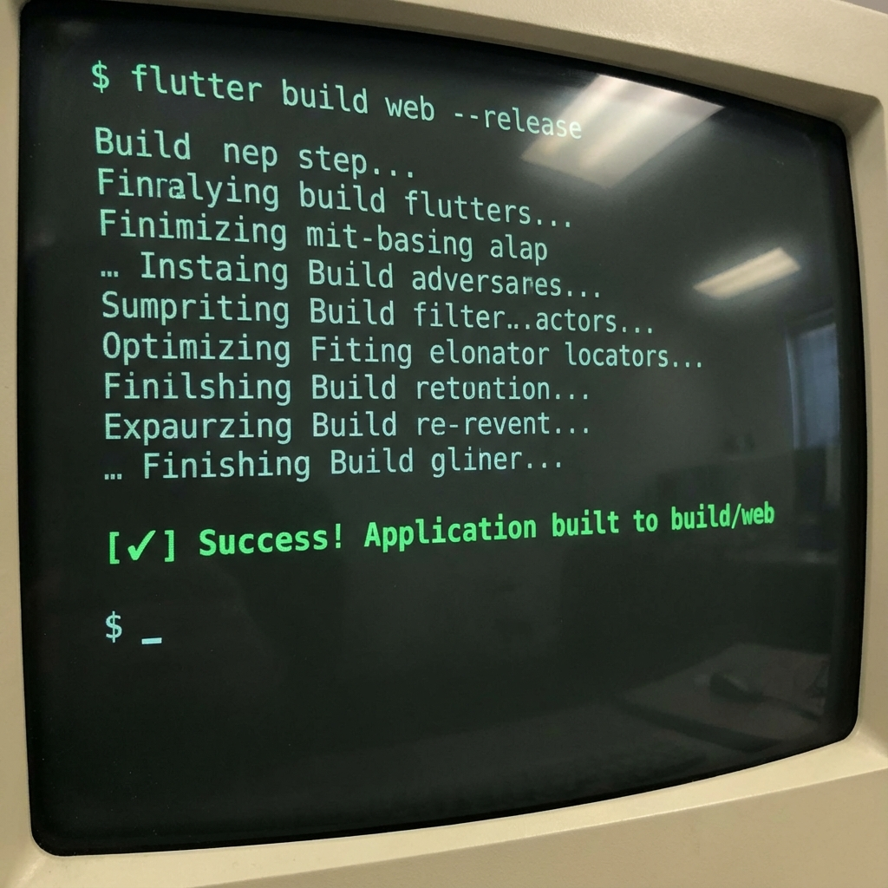
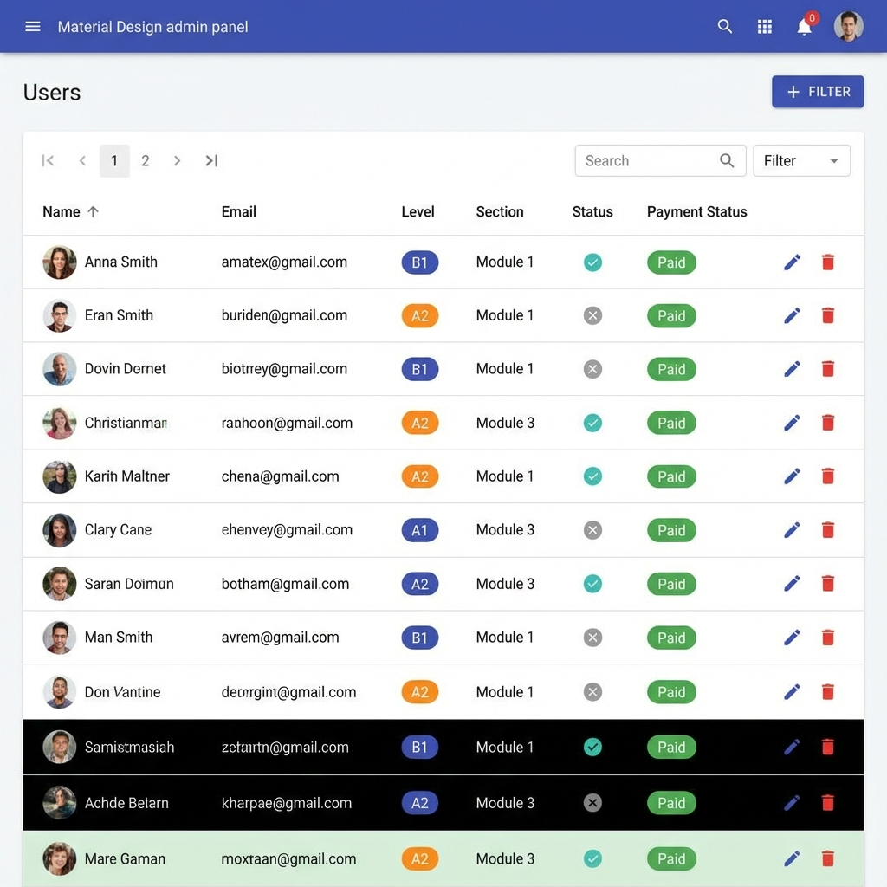
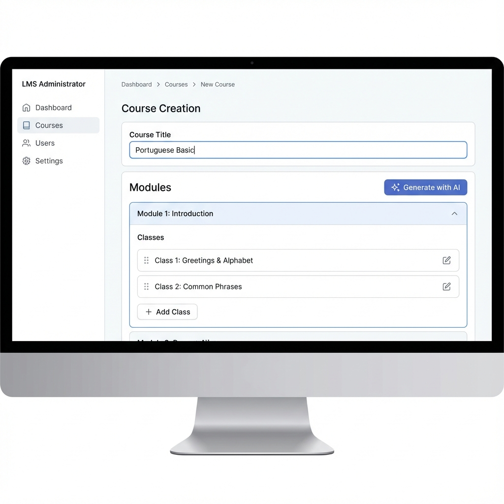

# Guía de Despliegue en Producción (Firebase Hosting)

Esta guía detalla paso a paso cómo desplegar el panel de administración **LMS Admin** en Firebase Hosting.

## 1. Prerrequisitos

Asegúrate de tener instaladas las siguientes herramientas en tu sistema:

1.  **Node.js & npm**: [Descargar Node.js](https://nodejs.org/) (necesario para Firebase CLI).
2.  **Flutter SDK**: Asegúrate de que Flutter esté en tu PATH (`flutter doctor`).
3.  **Firebase CLI**: Instálalo ejecutando el siguiente comando en tu terminal:
    ```powershell
    npm install -g firebase-tools
    ```
    
## 2. Configuración en una Nueva PC

Si estás configurando este proyecto en una computadora nueva por primera vez, sigue estos pasos antes de proceder con el despliegue.

1.  **Clonar el Repositorio**:
    Abre una terminal (PowerShell o Git Bash) y ejecuta:
    ```powershell
    git clone https://github.com/jesus-bazan-entel/apolo-lms-admin.git
    cd apolo-lms-admin
    ```

2.  **Instalar Dependencias de Flutter**:
    Descarga todas las librerías necesarias del proyecto:
    ```powershell
    flutter pub get
    ```

3.  **Verificar Entorno**:
    Asegurate de que no haya errores pendientes en tu instalación de Flutter:
    ```powershell
    flutter doctor
    ```

Once you have completed these steps, you can proceed to the **Firebase Configuration** below.

## 3. Configuración de Servicios en Firebase

Antes de compilar, necesitas conectar la aplicación con tu proyecto de Firebase y habilitar los servicios necesarios.

### Paso 3.1: Crear Proyecto en Firebase Console
1. Ve a [Firebase Console](https://console.firebase.google.com/).
2. Crea un nuevo proyecto (ej. `apolo-lms-prod`).
3. Desactiva Google Analytics si no lo necesitas (opcional).


### Paso 3.2: Habilitar Servicios
En el panel izquierdo de la consola de Firebase, configura lo siguiente:

*   **Authentication**:
    *   Habilita "Email/Password".
*   **Firestore Database**:
    *   Crea una base de datos.
    *   Selecciona la ubicación (ej. `nam5` o la más cercana).
    *   Comienza en **Modo de producción**.
*   **Storage**:
    *   Habilita Storage.
    *   Comienza en **Modo de producción**.

### Paso 3.3: Conectar la App (FlutterFire)
Para que la aplicación sepa a qué base de datos conectarse, debes actualizar la configuración.

1.  **Instalar Firebase CLI Tools** (si no lo hiciste en el paso 1):
    ```powershell
    dart pub global activate flutterfire_cli
    ```

2.  **Configurar el proyecto**:
    Ejecuta el siguiente comando en la raíz del proyecto y sigue las instrucciones interactivos, seleccionando tu nuevo proyecto y la plataforma **Web**:
    ```powershell
    flutterfire configure
    ```
    *Esto sobrescribirá el archivo `lib/firebase_options.dart` con las credenciales correctas.*

## 4. Configuración de Hosting (Firebase Hosting)

Si es la primera vez que despliegas el hosting en este proyecto:

1.  **Iniciar sesión**:
    ```powershell
    firebase login
    ```

2.  **Inicializar el hosting**:
    Ejecuta este comando en la raíz:
    ```powershell
    firebase init hosting
    ```
    
    Responde a las preguntas:
    - **Use an existing project**: Selecciona el proyecto que creaste en el paso 3.1.
    - **Public directory**: `build/web` (CRITICO).
    - **Single-page app**: `Y`.
    - **Automatic builds**: `N`.

## 5. Construcción y Despliegue

El proyecto incluye un `Makefile`, pero está diseñado para entornos Unix (Linux/Mac) o Git Bash. Para Windows (PowerShell), recomendamos ejecutar los comandos manualmente para evitar errores de compatibilidad.

### Paso 5.1: Configurar el Nombre de la App (Opcional)
Si deseas cambiar el nombre de la aplicación (que aparece en la pestaña del navegador), edita manualmente el archivo:
`lib/configs/app_config.dart`
```dart
static const String appName = 'Tu Nuevo Nombre';
```

### Paso 5.2: Compilar el Proyecto
Ejecuta los siguientes comandos en orden para generar la versión optimizada para producción:

```powershell
# Limpiar archivos antiguos
flutter clean

# Obtener dependencias
flutter pub get

# Construir la aplicación web en modo release
flutter build web --release
```

Si el comando termina con éxito, verás los archivos generados en la carpeta `build/web`.



### Paso 5.3: Desplegar en Firebase
Una vez compilado, sube los archivos a los servidores de Firebase:

```powershell
firebase deploy
```

Si solo quieres desplegar el hosting (y no reglas de base de datos u otras funciones si las hubiera):
```powershell
firebase deploy --only hosting
```

Al finalizar, la terminal te mostrará la **Hosting URL** (ej. `https://tu-proyecto.web.app`) donde podrás ver tu aplicación en vivo.

## Solución de Problemas Comunes

- **Error: "firebase" no se reconoce como un comando interno**: Asegúrate de haber instalado `npm install -g firebase-tools` y reinicia tu terminal.
- **Pantalla blanca al abrir la web**:
    - Abre la consola del desarrollador (F12) en el navegador para ver los errores.
    - Asegúrate de haber respondido `Y` a la pregunta de "Single-page app" durante `firebase init`.
    - Si usas un renderizado html vs canvas, intenta compilar con: `flutter build web --release --web-renderer html` (aunque auto suele funcionar bien).

---
**Nota sobre el Makefile**: Si tienes instalado `make` y un entorno tipo Unix (como Git Bash) en Windows, puedes simplemente ejecutar `make build_web`, pero los pasos manuales anteriores son más seguros y transparentes.

## 6. Control de Versiones (GitHub)

El código fuente de este proyecto está alojado en GitHub.
**Repositorio**: [https://github.com/jesus-bazan-entel/apolo-lms-admin.git](https://github.com/jesus-bazan-entel/apolo-lms-admin.git)

Para subir cambios futuros:
```powershell
git add .
git commit -m "Descripción de los cambios"
git push
```

## 7. Referencia Visual de la Aplicación

A continuación se muestran las pantallas principales del sistema para referencia:

### Dashboard Principal


### Gestión de Usuarios (Niveles y Secciones)


### Editor de Cursos con AI

